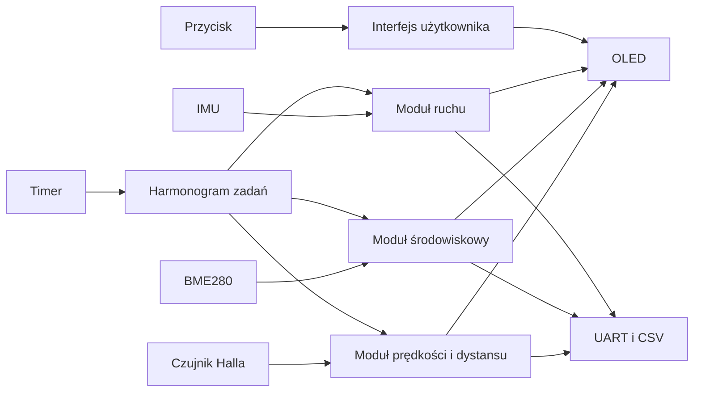

# Komputer rowerowy STM32

## Opis projektu

**Komputer rowerowy STM32** to projekt systemu wbudowanego napisanego w języku C dla mikrokontrolera STM32. Celem projektu jest budowa prototypu komputera rowerowego, który mierzy, przetwarza i prezentuje parametry jazdy w czasie rzeczywistym.

Projekt łączy pomiar impulsów z czujnika Halla, dane środowiskowe, dane z IMU, obliczenia parametrów pochodnych, interfejs OLED oraz diagnostykę UART/CSV.

## Najważniejsze funkcje

- pomiar prędkości i dystansu z czujnika Halla,
- pomiar temperatury, ciśnienia i wilgotności,
- estymacja wysokości na podstawie ciśnienia,
- obliczanie nachylenia trasy, VAM i przewyższenia,
- odczyt danych z IMU,
- szacowanie mocy rowerzysty,
- wielostronicowy interfejs OLED,
- logowanie danych przez UART i CSV.

## Architektura w skrócie

## Platforma sprzętowa

| Element | Rola |
|---|---|
| STM32L432KC / NUCLEO-L432KC | główny mikrokontroler |
| czujnik Halla | pomiar obrotów koła |
| BME280 | temperatura, ciśnienie, wilgotność |
| IMU | orientacja i drgania |
| OLED SSD1306 | prezentacja danych |
| UART | diagnostyka i eksport CSV |

## Dokumentacja

| Plik | Zawartość |
|---|---|
| `docs/architecture.md` | architektura systemu |
| `docs/hardware.md` | opis sprzętu |
| `docs/firmware.md` | organizacja firmware'u |
| `docs/algorithms.md` | algorytmy obliczeniowe |
| `docs/calibration.md` | kalibracja |
| `docs/testing.md` | testowanie i walidacja |
| `docs/uart_csv_protocol.md` | UART i CSV |
| `docs/ui_oled.md` | interfejs OLED |
| `docs/power_model.md` | model mocy |
| `docs/roadmap.md` | plan rozwoju |
| `docs/portfolio_summary.md` | opis do portfolio |

## Status projektu

Projekt jest prototypem systemu wbudowanego przeznaczonym do dalszych testów, rozwoju i walidacji w rzeczywistych warunkach jazdy.

## Autor

**Maciej Molik**
