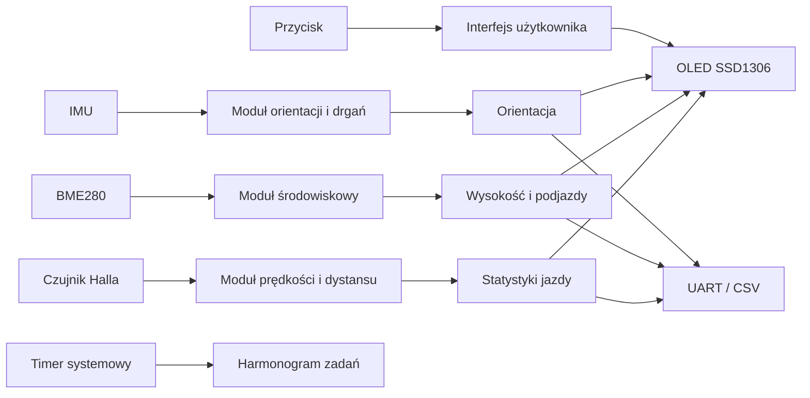

# Komputer rowerowy STM32

## Spis treści

1. [Opis projektu](#opis-projektu)
2. [Najważniejsze funkcje](#najważniejsze-funkcje)
3. [Architektura w skrócie](#architektura-w-skrócie)
4. [Bloki systemu](#bloki-systemu)
5. [Dokumentacja techniczna](#dokumentacja-techniczna)
6. [Uruchomienie projektu](#uruchomienie-projektu)
7. [Status i dalszy rozwój](#status-i-dalszy-rozwój)
8. [Autor](#autor)

## Opis projektu

**Komputer rowerowy STM32** to projekt systemu wbudowanego napisany w języku C dla mikrokontrolera STM32. Celem projektu jest zbudowanie prototypu urządzenia, które mierzy parametry jazdy rowerem, przetwarza dane z czujników i prezentuje wyniki na wyświetlaczu OLED oraz przez interfejs UART.

Projekt nie jest tylko prostym licznikiem prędkości. Łączy kilka typowych zagadnień z elektroniki i systemów embedded: obsługę przerwań, pomiar impulsów, komunikację I2C, obliczenia parametrów fizycznych, filtrowanie danych, prosty interfejs użytkownika i logowanie danych diagnostycznych.

## Najważniejsze funkcje

- pomiar prędkości i dystansu z czujnika Halla,
- wykrywanie zatrzymania roweru,
- statystyki jazdy: dystans, czas ruchu, prędkość średnia i maksymalna,
- pomiar temperatury, ciśnienia i wilgotności z BME280,
- estymacja wysokości na podstawie ciśnienia,
- obliczanie nachylenia trasy, VAM i przewyższenia,
- odczyt danych z IMU,
- estymacja orientacji płytki: roll i pitch,
- wskaźnik drgań oparty o dane z akcelerometru,
- uproszczony model szacowania mocy rowerzysty,
- wielostronicowy interfejs OLED,
- diagnostyka UART i eksport danych w formacie CSV,
- dokumentacja techniczna przygotowana pod rozwój projektu i portfolio.

## Architektura w skrócie

## Bloki systemu

| Blok | Zadanie |
|---|---|
| Czujnik Halla | generuje impulsy odpowiadające obrotom koła |
| Moduł prędkości | przelicza impulsy na prędkość, dystans i stan ruchu |
| BME280 | mierzy temperaturę, ciśnienie i wilgotność |
| Moduł środowiskowy | przelicza dane środowiskowe, w tym wysokość z ciśnienia |
| IMU | dostarcza dane z akcelerometru do orientacji i drgań |
| Moduł orientacji | oblicza roll, pitch i wskaźniki ruchu |
| Model mocy | szacuje orientacyjną moc rowerzysty |
| OLED | pokazuje dane lokalnie na kilku ekranach |
| UART / CSV | umożliwia diagnostykę i zapis danych do analizy |

## Dokumentacja techniczna

Pełna dokumentacja jest podzielona na osobne pliki:

| Plik | Opis |
|---|---|
| [docs/00_spis_tresci.md](docs/00_spis_tresci.md) | główny spis dokumentacji |
| [docs/01_architektura.md](docs/01_architektura.md) | architektura systemu i opis bloków |
| [docs/02_sprzet.md](docs/02_sprzet.md) | opis sprzętu, czujników i połączeń |
| [docs/03_firmware.md](docs/03_firmware.md) | organizacja firmware'u i modułów |
| [docs/04_algorytmy.md](docs/04_algorytmy.md) | algorytmy prędkości, wysokości, VAM i mocy |
| [docs/05_oled_ui.md](docs/05_oled_ui.md) | interfejs OLED i strony ekranu |
| [docs/06_uart_csv.md](docs/06_uart_csv.md) | diagnostyka UART i format CSV |
| [docs/07_kalibracja.md](docs/07_kalibracja.md) | kalibracja urządzenia |
| [docs/08_testy_walidacja.md](docs/08_testy_walidacja.md) | plan testów i walidacji |

## Uruchomienie projektu

Wymagane środowisko:

- STM32CubeIDE,
- STM32CubeMX,
- pakiet STM32Cube dla rodziny L4,
- płytka NUCLEO-L432KC lub zgodna,
- czujniki podłączone przez I2C,
- wyświetlacz OLED SSD1306,
- terminal UART ustawiony na 115200 8N1.

Podstawowy przepływ pracy:

1. Sklonować repozytorium.
2. Otworzyć projekt w STM32CubeIDE.
3. Sprawdzić konfigurację `.ioc`.
4. Zbudować projekt.
5. Wgrać firmware przez ST-LINK.
6. Otworzyć terminal UART i sprawdzić logi diagnostyczne.
7. Przeprowadzić testy stanowiskowe i terenowe.

## Status i dalszy rozwój

Projekt jest prototypem. Najważniejsze kolejne kroki to:

- dodać zdjęcia połączeń i ekranu OLED,
- dodać przykładowy log CSV z jazdy,
- uporządkować kod w moduły opisane w dokumentacji,
- przeprowadzić walidację terenową,
- przygotować projekt własnej płytki PCB.

## Autor

**Maciej Molik**
