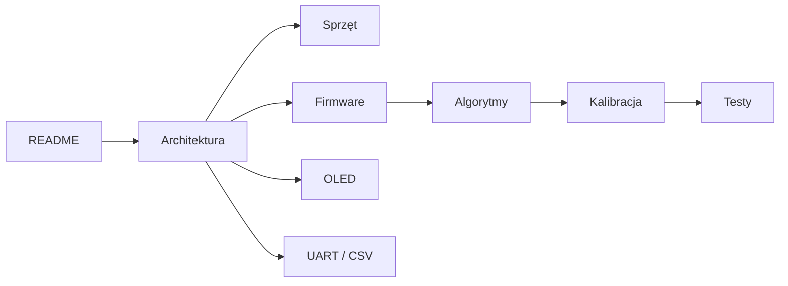

# Dokumentacja projektu - spis treści

Ten katalog zawiera dokumentację techniczną projektu komputera rowerowego STM32. Dokumenty zostały podzielone tak, aby każdy plik odpowiadał za jeden obszar projektu.

## Pliki dokumentacji

1. [Architektura systemu](01_architektura.md)
2. [Sprzęt i czujniki](02_sprzet.md)
3. [Firmware](03_firmware.md)
4. [Algorytmy](04_algorytmy.md)
5. [Interfejs OLED](05_oled_ui.md)
6. [UART i CSV](06_uart_csv.md)
7. [Kalibracja](07_kalibracja.md)
8. [Testy i walidacja](08_testy_walidacja.md)

## Proponowana kolejność czytania

Najpierw warto przeczytać `README.md`, następnie dokument architektury, a dopiero później przejść do szczegółów sprzętu, firmware'u i algorytmów.

