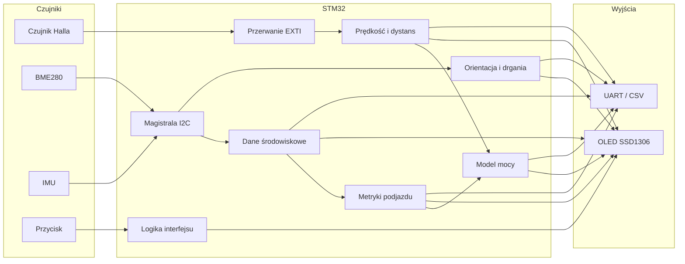
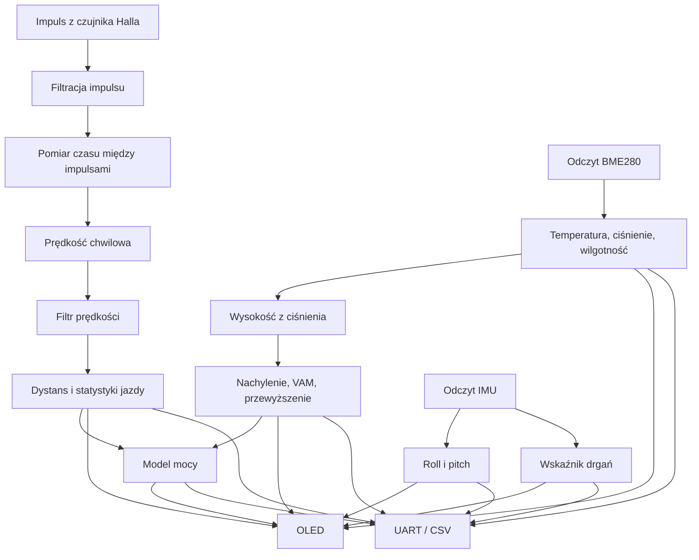

# Architektura systemu

## Spis treści

1. [Cel architektury](#cel-architektury)
2. [Ogólny schemat systemu](#ogólny-schemat-systemu)
3. [Pełny przepływ danych](#pełny-przepływ-danych)
4. [Opis bloków](#opis-bloków)
5. [Warstwy systemu](#warstwy-systemu)
6. [Założenia projektowe](#założenia-projektowe)

## Cel architektury

Architektura projektu została podzielona na bloki, aby oddzielić pomiary, obliczenia, prezentację danych i diagnostykę. Dzięki temu projekt jest łatwiejszy do testowania, rozwijania i przeniesienia z płytki NUCLEO na własną płytkę PCB.

## Ogólny schemat systemu

## Pełny przepływ danych

## Opis bloków

### Czujnik Halla

Czujnik Halla wykrywa obrót koła. Każdy impuls oznacza przejście magnesu obok czujnika. Na podstawie czasu między impulsami można obliczyć prędkość, a na podstawie liczby impulsów - dystans.

### Przerwanie EXTI

Przerwanie powinno wykonywać minimalną pracę: zapisać czas impulsu, sprawdzić prostą blokadę przeciwdrganiową i ustawić flagę dla pętli głównej. Dzięki temu system pozostaje responsywny.

### Moduł prędkości i dystansu

Moduł przelicza impulsy na prędkość chwilową, prędkość filtrowaną, dystans przejazdu, czas ruchu oraz prędkość średnią i maksymalną.

### BME280

BME280 mierzy temperaturę, ciśnienie i wilgotność. Ciśnienie jest używane również do estymacji wysokości, co pozwala obliczać przewyższenie i nachylenie trasy.

### IMU

IMU dostarcza dane z akcelerometru. W projekcie można je wykorzystać do obliczenia roll, pitch oraz prostego wskaźnika drgań.

### Model mocy

Model mocy szacuje orientacyjny wysiłek rowerzysty. Uwzględnia składnik podjazdu, opory toczenia i opór aerodynamiczny. Wynik nie zastępuje profesjonalnego miernika mocy.

### OLED

OLED pokazuje dane lokalnie. Ze względu na mały ekran informacje powinny być podzielone na kilka stron, np. jazda, podjazd, środowisko, IMU i statystyki.

### UART / CSV

UART umożliwia diagnostykę i eksport danych do komputera. Tryb CSV pozwala zapisać dane z jazdy i później analizować je w Excelu, Pythonie lub innym narzędziu.

## Warstwy systemu

| Warstwa | Zadanie |
|---|---|
| Sprzęt | czujniki, OLED, przycisk, mikrokontroler |
| Sterowniki | GPIO, EXTI, I2C, UART, timery |
| Logika pomiarowa | prędkość, dystans, środowisko, IMU |
| Algorytmy | wysokość, nachylenie, VAM, moc |
| Prezentacja | OLED, UART, CSV |

## Założenia projektowe

- unikać blokujących opóźnień w pętli głównej,
- trzymać krótką obsługę przerwań,
- oddzielać logikę aplikacji od kodu wygenerowanego przez CubeMX,
- stosować czytelne nazwy zmiennych z jednostkami,
- umożliwić testowanie poszczególnych bloków osobno.
