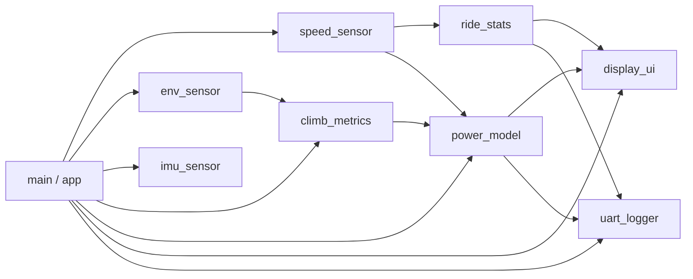

# Firmware

## Spis treści

1. [Cel firmware'u](#cel-firmwareu)
2. [Proponowany podział modułów](#proponowany-podział-modułów)
3. [Pętla główna](#pętla-główna)
4. [Obsługa przerwań](#obsługa-przerwań)
5. [Harmonogram zadań](#harmonogram-zadań)
6. [Obsługa błędów](#obsługa-błędów)
7. [Zasady jakości kodu](#zasady-jakości-kodu)

## Cel firmware'u

Firmware odpowiada za inicjalizację peryferiów, obsługę czujników, obliczenia parametrów jazdy, prezentację danych na OLED oraz logowanie przez UART.

## Proponowany podział modułów

| Moduł | Zadanie |
|---|---|
| `app` | koordynacja działania aplikacji |
| `speed_sensor` | obsługa czujnika Halla, prędkości i dystansu |
| `ride_stats` | czas jazdy, średnia, maksimum, dystans |
| `env_sensor` | odczyt BME280 |
| `imu_sensor` | odczyt IMU i podstawowa obróbka |
| `climb_metrics` | wysokość, nachylenie, VAM, przewyższenie |
| `power_model` | uproszczone szacowanie mocy |
| `display_ui` | logika stron OLED |
| `uart_logger` | komunikaty diagnostyczne i CSV |

## Pętla główna

Pętla główna powinna wykonywać zadania cyklicznie bez długich blokujących opóźnień. Każde zadanie powinno sprawdzać, czy nadszedł czas jego uruchomienia.

Przykładowe zadania:

- aktualizacja prędkości,
- odczyt BME280,
- odczyt IMU,
- przeliczenie parametrów podjazdu,
- aktualizacja OLED,
- wysłanie wiersza CSV.

## Obsługa przerwań

Przerwanie od czujnika Halla powinno być krótkie. Nie powinno wykonywać długich obliczeń ani komunikacji po I2C/UART.

Zalecany schemat:

1. odczytać aktualny czas,
2. sprawdzić minimalny odstęp od poprzedniego impulsu,
3. zapisać czas impulsu,
4. zwiększyć licznik impulsów,
5. ustawić flagę dla pętli głównej.

## Harmonogram zadań

| Zadanie | Przykładowy okres |
|---|---:|
| aktualizacja prędkości | 100-200 ms |
| odczyt IMU | 200 ms |
| odczyt BME280 | 1000 ms |
| odświeżanie OLED | 200-500 ms |
| UART / CSV | 1000 ms |

## Obsługa błędów

Firmware powinien rozpoznawać:

- brak odpowiedzi czujnika I2C,
- błędną inicjalizację OLED,
- brak impulsów z czujnika Halla,
- wartości spoza zakresu,
- problem z komunikacją UART.

## Zasady jakości kodu

- ograniczać kod użytkownika w sekcjach generowanych przez CubeMX,
- przenosić logikę do osobnych modułów,
- stosować nazwy zmiennych z jednostkami, np. `_ms`, `_m`, `_kmh`, `_deg`,
- unikać magicznych liczb,
- trzymać parametry konfiguracyjne w jednym miejscu,
- dokumentować tylko te fragmenty, których działanie nie jest oczywiste.
