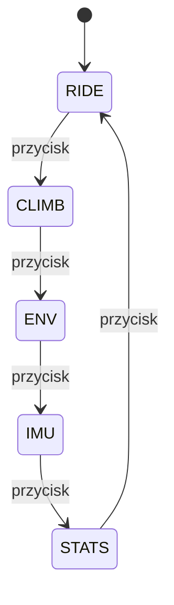

# Interfejs OLED

## Cel interfejsu

Wyświetlacz OLED ma pokazywać dane w sposób czytelny podczas jazdy. Ekran 128x64 ma ograniczoną przestrzeń, dlatego informacje powinny być podzielone na kilka stron.

## Przepływ stron



## Proponowane strony

| Strona | Dane |
|---|---|
| RIDE | prędkość, dystans, czas jazdy |
| CLIMB | wysokość, nachylenie, VAM, przewyższenie |
| ENV | temperatura, ciśnienie, wilgotność, punkt rosy |
| IMU | roll, pitch, wskaźnik drgań |
| STATS | średnia, maksimum, moc, energia |

## Zasady projektowania ekranu

- największą czcionką pokazywać najważniejszą wartość,
- nie umieszczać zbyt wielu liczb na jednej stronie,
- stosować krótkie etykiety,
- odświeżać ekran z rozsądną częstotliwością,
- unikać migotania i pełnego czyszczenia ekranu, jeśli nie jest konieczne.

## Przykładowy ekran RIDE

```text
SPD  24.6 km/h
TRP  12.43 km
MOV  00:36:12
AVG  20.8 km/h
```

## Przykładowy ekran CLIMB

```text
ALT  348 m
GRD  4.2 %
VAM  620 m/h
ASC  214 m
```
