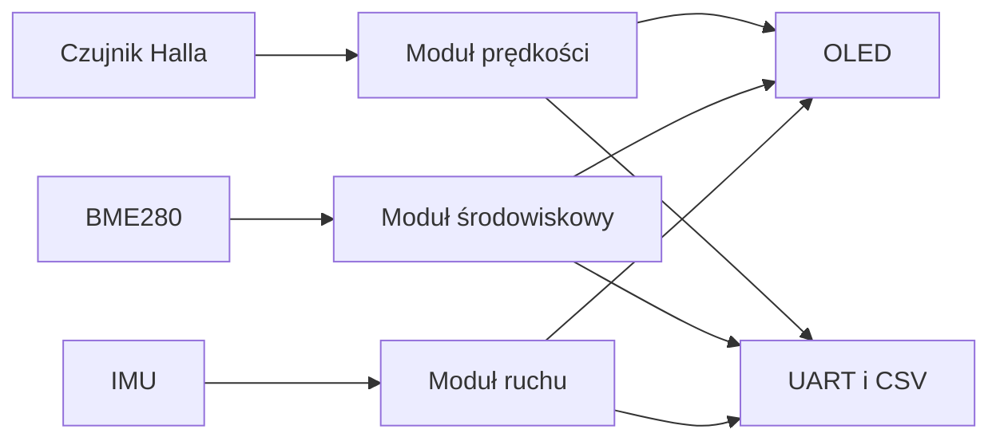

# Architektura systemu

## Architektura w skrócie

```mermaid
flowchart LR
    A[Czujnik Halla] --> B[Moduł prędkości]
    C[BME280] --> D[Moduł środowiskowy]
    E[IMU] --> F[Moduł ruchu]
    B --> G[OLED]
    D --> G
    F --> G
    B --> H[UART i CSV]
    D --> H
    F --> H
```

## Opis

Mikrokontroler STM32 zbiera dane z czujników, przetwarza je w firmware i prezentuje wyniki na ekranie OLED oraz przez UART.
